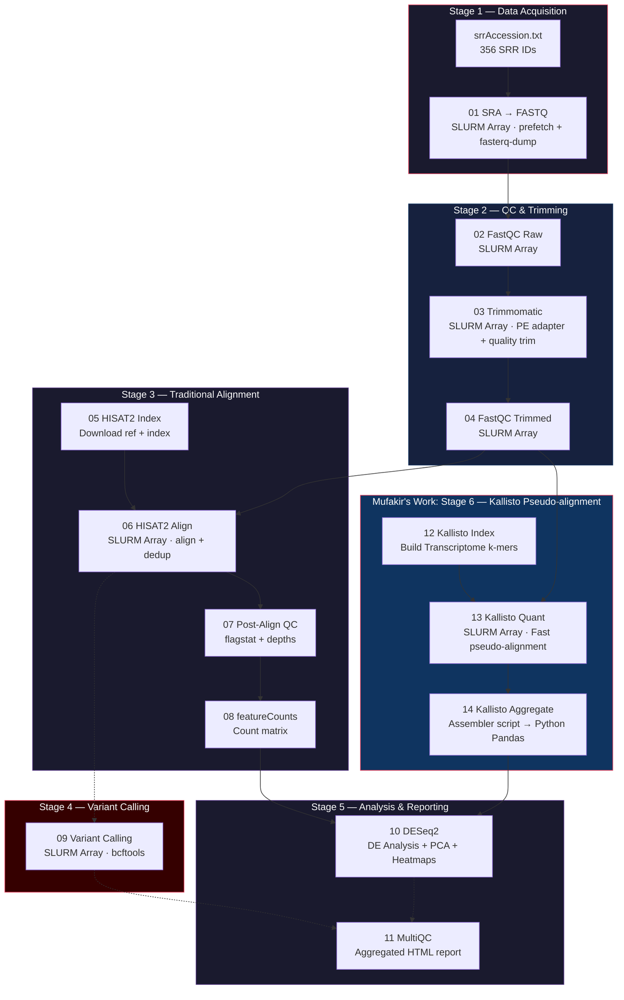

# Ebola RNA-seq Pipeline

An advanced High-Performance Computing (HPC) pipeline for analyzing 356 Sequence Read Archive (SRA) runs from the 2014 West African Ebola Outbreak (PRJNA938511). Built for the Ohio Supercomputer Center (OSC) Ascend/Cardinal clusters, this repository features full automation, SLURM array checkpoints, structured logging, and dual-quantification tracking using both HISAT2+featureCounts and Kallisto.

## Overview

| Property | Value |
|---|---|
| **Dataset** | PRJNA938511 — 2014 West African Ebola Outbreak |
| **Scale** | 356 SRR runs (~0.83 TB raw data via batch processing) |
| **Reference** | KJ660346.2 (Ebola virus Makona) |
| **HPC** | Ohio Supercomputer Center (Ascend/Cardinal) |
| **Key Features** | Trimmomatic PE, HISAT2, Kallisto, bcftools, DESeq2, MultiQC |

## Pipeline Architecture & Flowchart

Our processing architecture utilizes a **Dual-Quantification** approach. Read datasets are both traditionally aligned (for variant calling and standard quantification) and simultaneously pseudo-aligned (for rapid, high-accuracy counting).



## Quick Start

### 1. Initial Setup
```bash
# Create the conda environment dependencies
sbatch scripts/00_setup_conda_env.sh
```

### 2. General Orchestration
The entire pipeline is connected using SLURM `#SBATCH --dependency=afterok` chains to guarantee that jobs only trigger when their upstream requirements successfully complete without errors.
```bash
# Submit all core alignment and variant stages
bash scripts/run_pipeline.sh

# Monitor active queues
squeue -u $USER
```

### 3. Kallisto Orchestration (Mufakir Ansari)
A separate lightweight track ensures ultra-fast transcript quantification via Kallisto.
```bash
# Build Ebola virus index via transcriptome
sbatch scripts/12_kallisto_index.sh

# Dispatch array to quantify all samples 1-50 concurrently
sbatch scripts/13_kallisto_quant.sh

# Recompile outputs and cross-validate against featureCounts
sbatch scripts/14_kallisto_aggregate.sh
```

## Outputs

| Output Directory | Description |
|---|---|
| **kallisto_output/** | Kallisto generated TPM & Gene Count matrices + Validation scatter plots |
| **counts/** | Traditional `gene_counts_clean.txt` generated using HISAT2/featureCounts |
| **variants/** | Variant Calling Format (`.vcf`) results tracing specific epidemic variants |
| **deseq2_results/** | Differential expression mapping, PCA matrices, Distance Heatmaps |
| **multiqc_report/** | Aggregated full pipeline quality control HTML visualizer |

## Development & Configuration

All critical definitions (like node requests, trimming window bounds `TRIM_SLIDINGWINDOW`, or HISAT parameters) reside within `pipeline.config`. The pipeline gracefully handles checkpointing (saving completed sample states in `.checkpoints/`) preventing duplicate billing on HPC nodes during restarts.
