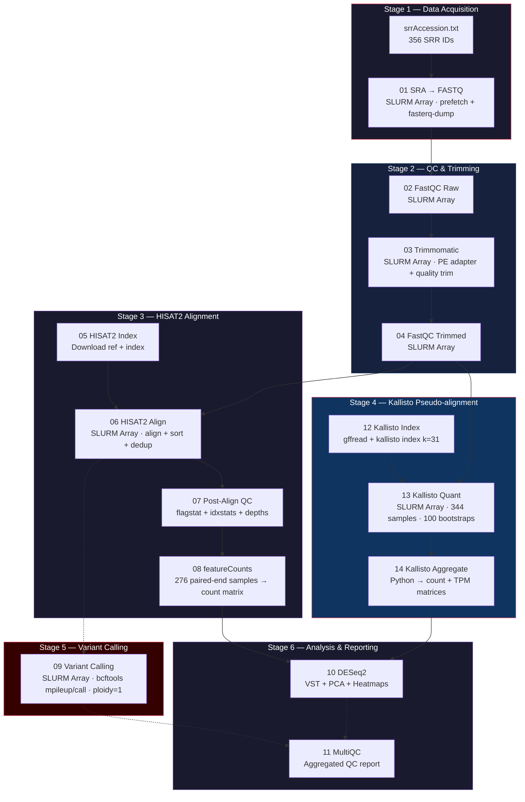

# Ebola RNA-seq Pipeline

An end-to-end HPC pipeline for analyzing 356 SRA runs from the 2014 West African Ebola Outbreak (PRJNA938511). Built for the Ohio Supercomputer Center (OSC) Ascend cluster with SLURM array job parallelization, checkpointing, and dual-quantification (HISAT2 + Kallisto).

## Overview

| Property | Value |
|---|---|
| **Dataset** | PRJNA938511 — 2014 West African Ebola Outbreak |
| **Accessions** | 356 SRR runs (344 successfully processed) |
| **Reference Genome** | KJ660346.2 (Ebola virus, Zaire ebolavirus, Makona variant) |
| **HPC Environment** | Ohio Supercomputer Center — Ascend cluster |
| **Scheduler** | SLURM with array jobs and checkpoint-based resume |
| **Tools** | SRA Toolkit, FastQC, Trimmomatic, HISAT2, Picard, featureCounts (Subread), Kallisto, bcftools, DESeq2 |

## Data Scale

| Output | File Count | Description |
|---|---|---|
| Raw data | 296 SRA files | downloaded from NCBI |
| FastQC | 592 reports | pre- and post-trimming |
| Trimmed FASTQ | 592 files | paired-end reads |
| Alignments | 296 BAM files | aligned to `KJ660346.2` |
| Feature Counts | 1 matrix | gene-level quantification |
| Kallisto quant | 296 directories | transcript-level quantification |
| Variant calls | 296 VCF files | per-sample filtered VCFs |

## Pipeline Results

| Metric | Value |
|---|---|
| SRA runs downloaded | 356 (merged to 296 biological samples) |
| FastQC reports generated | 592 (raw + trimmed) |
| Trimmed paired FASTQ files | 592 |
| Deduplicated BAM files | 296 |
| Paired-end BAMs (featureCounts input) | 245 |
| Ebola genes quantified | 7 (NP, VP35, VP40, GP, VP30, VP24, L) |
| Total assigned Ebola read pairs | 15,131,200 |
| Samples with detectable virus | 157 / 245 (64.1%) |
| Samples with filtered variants | 111 / 296 (37.5%) |
| Total filtered SNPs | 31,786 |
| Total filtered Indels | 4 |
| Median reads per sample | 14 |
| Max reads per sample | 3,678,592 (SRR38105630) |
| Kallisto vs featureCounts correlation (per-sample) | r = 0.9978 |
| Kallisto vs featureCounts correlation (per-gene) | r = 0.9569 |
| Gene-gene co-expression | All pairwise r ≥ 0.97 |
| Publication figures generated | 14 |

### Per-Gene Expression (featureCounts, 245 samples)

| Gene | Function | Total Read Pairs | % of Total |
|---|---|---:|---:|
| **L** | RNA-dependent RNA polymerase | 5,234,980 | 34.6% |
| **GP** | Glycoprotein (surface) | 2,761,102 | 18.2% |
| **VP40** | Matrix protein | 2,382,888 | 15.7% |
| **NP** | Nucleoprotein | 1,558,798 | 10.3% |
| **VP35** | Polymerase cofactor | 1,357,331 | 9.0% |
| **VP24** | Secondary matrix protein | 1,280,942 | 8.5% |
| **VP30** | Transcription activator | 555,159 | 3.7% |

## Pipeline Architecture



## Quick Start

### 1. Setup
```bash
sbatch scripts/00_setup_conda_env.sh
```

### 2. Run Full Pipeline
The coordinator submits each step sequentially, waiting for completion before submitting the next. This avoids exceeding SLURM's 1,000 MaxSubmitJobsPerUser limit when running 356-task array jobs.
```bash
# Run all steps (00 through 14)
sbatch coordinator.sh

# Resume from a specific step
sbatch coordinator.sh --start-from 08

# Run a subset of steps only
sbatch coordinator.sh --start-from 09 --stop-at 14
```

### 3. Monitor
```bash
# Check active jobs
squeue -u $USER

# Watch coordinator progress
tail -f logs/coordinator_<JOBID>.log

# Check specific step logs
ls -lt logs/08_featurecounts_*.log | head -1 | xargs tail -20
```

### 4. Generate Figures
```bash
python3 scripts/generate_plots.py     # 6 core figures
python3 scripts/generate_plots_v2.py  # 7 additional figures
```

## Output Data Files

### featureCounts (`counts_git/`)

| File | Format | Dimensions | Description |
|------|--------|-----------|-------------|
| `gene_counts_clean.txt` | TSV | 7 rows × 246 cols (1 gene ID + 245 samples) | Cleaned gene-level read pair counts. Rows: NP, VP35, VP40, GP, VP30, VP24, L. Columns: one per paired-end BAM sample. |
| `gene_counts.txt.summary` | TSV | 14 status rows × 246 cols | featureCounts assignment summary per sample. Categories: Assigned, Unassigned_Unmapped, Unassigned_NoFeatures, Unassigned_Ambiguity, etc. |

### Kallisto (`kallisto_git/`)

| File | Format | Dimensions | Description |
|------|--------|-----------|-------------|
| `count_matrix_kallisto.csv` | CSV | 7 rows × 297 cols (1 gene ID + 296 samples) | Estimated read counts per gene from Kallisto pseudo-alignment. Genes: GP, L, NP, VP24, VP30, VP35, VP40. |
| `tpm_matrix_kallisto.csv` | CSV | 7 rows × 297 cols (1 gene ID + 296 samples) | Transcripts Per Million (TPM) values, length-normalized expression for cross-sample comparison. |

### DESeq2 (`deseq2_git/`)

| File | Format | Description |
|------|--------|-------------|
| `summary_statistics.csv` | CSV | Pipeline summary: 7 genes, 245 samples, 15,131,200 total assigned reads, mean 61,760 reads/sample, median 14 reads/sample. |
| `library_sizes.csv` | CSV | Per-sample library sizes (total assigned reads) for 245 samples. |
| `pca_plot.pdf` | PDF | PCA of variance-stabilized counts. PC1 separates high vs low viral load samples. |
| `pca_plot.png` | PNG | Same PCA plot in raster format. |
| `sample_distance_heatmap.pdf` | PDF | Euclidean distance heatmap between all 245 samples (VST-transformed). |
| `top_variable_genes_heatmap.pdf` | PDF | Heatmap of all 7 Ebola genes across all samples. |
| `expression_distribution.pdf` | PDF | Histogram of VST-normalized expression values. |

### Variants (`variants_git/`)

| File | Format | Description |
|------|--------|-------------|
| `variant_summary.tsv` | TSV | Aggregated variant counts (raw, filtered, SNPs, Indels) for all 296 biological samples. |


## Generated Figures

| # | Figure | Description |
|---|--------|-------------|
| 1 | `gene_expression_total.png` | Total read pairs per Ebola gene |
| 2 | `sample_viral_load_ranked.png` | Top 50 samples ranked by Ebola read count |
| 3 | `gene_expression_boxplots.png` | log₂(count+1) distribution per gene |
| 4 | `viral_load_heatmap.png` | Heatmap of 7 genes × top 40 samples |
| 5 | `kallisto_vs_featurecounts.png` | Per-gene total expression correlation (r=0.9569) |
| 6 | `kallisto_vs_star_scatter.png` | Per-gene log-log scatter (Spearman rho) |
| 7 | `pipeline_summary.png` | Summary statistics panel |
| 8 | `gene_proportions_stacked.png` | Gene composition per sample (% stacked bar) |
| 9 | `viral_load_histogram.png` | Viral load distribution + detection rate pie |
| 10 | `sample_dendrogram.png` | Hierarchical clustering of samples (Ward's method) |
| 11 | `variant_summary.png` | SNPs and Indels per sample (119 with variants) |
| 12 | `assignment_summary_pie.png` | featureCounts assigned vs unassigned reads |
| 13 | `sample_correlation_scatter.png` | Per-sample Kallisto vs featureCounts (r=0.9978) |
| 14 | `gene_correlation_matrix.png` | Gene-gene Pearson correlation matrix |

## Hybrid Genome Pipeline (Steps 15–19, Not Executed)

The repository includes a hybrid genome analysis pipeline that re-aligns reads against a combined **human (GRCh38) + Ebola (KJ660346.2)** reference. This separates host and viral reads more accurately. These steps were implemented but not executed in this run to conserve compute time.

| Step | Script | Description |
|------|--------|-------------|
| 15 | `15_hybrid_genome_build.sh` | Download GRCh38, concatenate with Ebola ref, build hybrid HISAT2 index |
| 16 | `16_hybrid_hisat2_align.sh` | Re-align all trimmed reads to hybrid genome, extract Ebola-mapped reads |
| 17 | `17_hybrid_featurecounts.sh` | featureCounts on hybrid-aligned BAMs |
| 18 | `18_hybrid_kallisto_quant.sh` | Kallisto quant against hybrid transcriptome index |
| 19 | `19_hybrid_kallisto_aggregate.sh` | Aggregate hybrid Kallisto output into matrices |

To run the hybrid pipeline:
```bash
sbatch coordinator.sh --start-from 15
```

## All Repository Scripts

| Script | Purpose |
|--------|---------|
| `scripts/00_setup_conda_env.sh` | Install conda environments (DESeq2, MultiQC) |
| `scripts/01_sra_to_fastq.sh` | Download SRA and convert to FASTQ (SLURM array) |
| `scripts/02_fastqc_raw.sh` | FastQC on raw reads (SLURM array) |
| `scripts/03_trimmomatic.sh` | Adapter trimming and quality filtering (SLURM array) |
| `scripts/04_fastqc_trimmed.sh` | FastQC on trimmed reads (SLURM array) |
| `scripts/05_hisat2_index.sh` | Download Ebola reference and build HISAT2 index |
| `scripts/06_hisat2_align.sh` | HISAT2 alignment + sort + Picard dedup (SLURM array) |
| `scripts/07_post_align_qc.sh` | flagstat, idxstats, depth stats (SLURM array) |
| `scripts/08_featurecounts.sh` | Gene-level counting with paired-end validation |
| `scripts/09_variant_calling.sh` | bcftools mpileup/call per sample (SLURM array) |
| `scripts/10_deseq2_analysis.sh` | DESeq2 exploratory analysis wrapper |
| `scripts/11_multiqc_report.sh` | MultiQC aggregated QC report |
| `scripts/12_kallisto_index.sh` | Build Kallisto transcriptome index (k=31) |
| `scripts/13_kallisto_quant.sh` | Kallisto pseudo-alignment (SLURM array, 100 bootstraps) |
| `scripts/14_kallisto_aggregate.sh` | Aggregate Kallisto results wrapper |
| `scripts/15–19_hybrid_*.sh` | Hybrid genome pipeline (see above) |
| `scripts/deseq2_analysis.R` | DESeq2 R script (PCA, heatmaps, VST) |
| `scripts/kallisto_aggregate.py` | Merge per-sample Kallisto abundance files |
| `scripts/hybrid_kallisto_aggregate.py` | Merge hybrid Kallisto abundance files |
| `scripts/generate_plots.py` | 6 core publication figures |
| `scripts/generate_plots_v2.py` | 7 additional publication figures |
| `scripts/utils.sh` | Shared functions (logging, checkpointing, validation) |
| `coordinator.sh` | Sequential step orchestrator with `--start-from`/`--stop-at` |
| `batch_merge_processing.sh` | Concatenate multi-run biological replicates (66 SRR runs) |
| `submit_merge_jobs.sh` | SLURM submission wrapper for merge jobs |
| `batch_processing.sh` | Batch SLURM array submission for core pipeline |
| `one_sample_seq.sh` | Single-sample sequential processing (testing) |
| `run_and_verify.sh` | Pipeline verification and git push utility |
| `pipeline.config` | Central configuration (modules, paths, thresholds) |
| `srrAccession.txt` | 356 SRA accession IDs |

## Configuration

All pipeline parameters are defined in `pipeline.config`:
- Module versions (HISAT2, samtools, bcftools, etc.)
- Trimming parameters (sliding window, min length)
- Alignment parameters (HISAT2 options)
- Variant filter thresholds (QUAL, DP)
- Directory paths (raw, trimmed, aligned, counts, variants)

The pipeline uses checkpoint files in `.checkpoints/<step_name>/<SRR_ID>` to track completed samples. On re-runs, completed samples are skipped automatically.

## Contributors

- **Mufakir Ansari** — Kallisto pseudo-alignment pipeline, pipeline orchestration & coordinator, cross-validation analysis, figure generation, pipeline debugging & scaling to 356 samples
