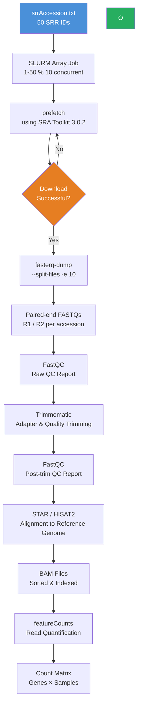

# Ebola RNA-seq Pipeline
An HPC pipeline for analyzing 50 SRR runs from the 2014 outbreak (PRJNA257197). Automates SRA extraction, QC, alignment, and variant calling. Built for graduate capstones as part of the coursework. In this, we are using HPC clusters from Ohio Super Computer, the clusters we used for this project are cardinal and ascend clusters.

## Overview
**Dataset:** PRJNA257197 - 2014 West African Ebola Outbreak
**Scale:** For simplicity, collected only 50 SRR runs (441 MB SRA / ~ 2.1 GB FASTQ)
**Workflow:**

